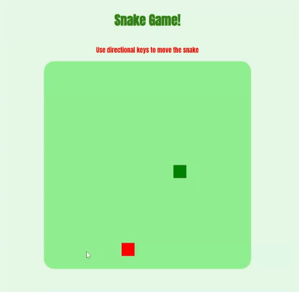

# Snake Game

This project is part from the course "Creating a Snake game style with HTML5 and CSS3" from [Digital Innovation One](https://web.digitalinnovation.one/) using Javascript.

    

---

# Guide

- [Features](#features)
- [Installation](#installation)
- [Using](#using)
- [Technologies](#technologies)
- [Future Implementations](#future-implementations)

# Features

- Users can control the snake.
- Users can "eat" food and becomes bigger.

# Installation

`git clone https://github.com/cledman/javascript-snake-game`

# Using

`Run the index.html file`

# Technologies

- [HTML](https://www.w3schools.com/html/) to write the page,
- [CSS](https://www.w3schools.com/css/) to handle the styles, layout and rendering,

# Future Implementations

- The game layout could more responsible
- We could have some music and sound effects.
- We could have score.

Thanks to:

- [Gabriela Pinheiro](https://www.linkedin.com/in/gabrielapinheiro129/)

##
